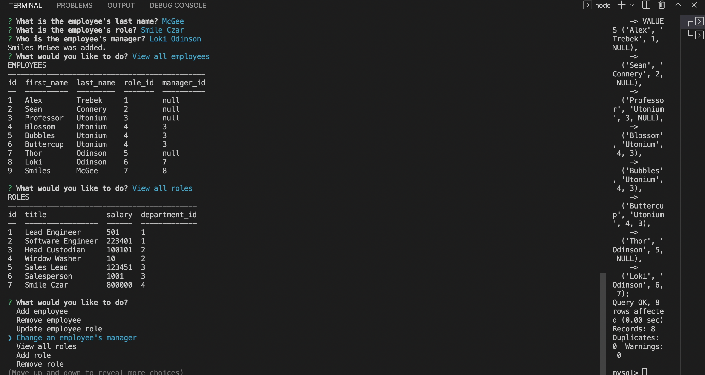

# Employee Tracker
  
  

  ## Description

  With the size of companies becoming ever larger, what's a business to do when they want to track various aspects of their mega-empire? Enter: EMPLOYEE TRACKER. Employee tracker is a command-line program that stores department, job role, and personnel info in a mysql database. Out of the box there are a variety of database query commands ready to go including adding/removing employees, departments, and roles, as well as a number of queries to view the info in different tables.

  ### Table of Contents

  * [Installation](#installation)
  * [Usage](#usage)
  * [Contribution Guidelines](#contribution-guidelines)
  * [Questions](#questions)
  

  ## Installation

  Clone this git and install all dependencies.

  ## Usage

  Navigate to this program's root directory in your terminal and use the command npm start. 
  
  Please enjoy this video example: 

  

  ## Contribution Guidelines

  Report issues and submit feature requests.

  ## Questions

  If you have any questions, you may contact me at: 

  * Github: https://github.com/anguswaffle
  * Email: aidan.bachtell@gmail.com

  ---

  ## License 

  Licensed under [MIT License](https://opensource.org/licenses/MIT). 